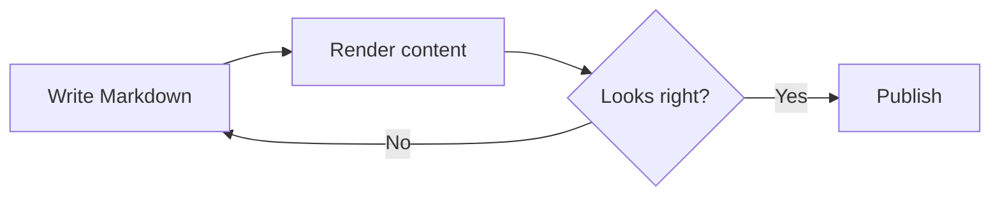

This sample exercises the most useful Markdown features in one place.

# Markdown Showcase

## Text styles

Regular text, **bold text**, *italic text*, ***bold italic***, ~~strikethrough~~, and `inline code`.

You can also highlight keyboard shortcuts such as <kbd>⌘</kbd> + <kbd>K</kbd>.

---

## Links and images

Visit [OpenAI](https://openai.com), or display an image:


## Quotes

> “Simplicity is the soul of efficiency.”
>
> — Austin Freeman

> A quote can contain nested content:
>
> - Lists
> - **Formatting**
> - `Code`

## Lists

### Unordered

- First item
- Second item
  - Nested item
  - Another nested item
- Third item

### Ordered

1. Gather requirements
2. Build the feature
3. Verify the result
4. Ship it

### Tasks

- [x] Create the demo
- [x] Add rich formatting
- [ ] Drink more coffee
- [ ] Conquer the world

## Table

| Feature | Supported | Example |
|:--|:--:|--:|
| Bold | ✅ | `**bold**` |
| Links | ✅ | `[label](url)` |
| Tables | ✅ | Three columns |
| Code blocks | ✅ | Syntax highlighting |
| Mermaid | Depends | Diagram rendering |

## Code

Inline JavaScript: `const answer = 42;`

```typescript
type User = {
  id: string;
  name: string;
  roles: string[];
};

function greet(user: User): string {
  return `Hello, ${user.name}!`;
}

console.log(
  greet({
    id: "usr_123",
    name: "Ada",
    roles: ["admin", "engineer"],
  }),
);
```

```diff
- const status = "pending";
+ const status = "complete";
```

## Diagram



## Callouts

> [!NOTE]
> This syntax renders as a callout in platforms that support GitHub-style alerts.

> [!TIP]
> Keep documents easy to scan with short sections and clear headings.

> [!WARNING]
> Rendering support can differ between Markdown implementations.

## Collapsible content

<details>
<summary>Open the hidden section</summary>

Here is some **hidden Markdown content**.

```json
{
  "revealed": true,
  "message": "You found it!"
}
```

</details>

## Footnotes

Markdown is designed to be readable as plain text.[^1]

Different renderers may support different extensions.[^renderer]

[^1]: John Gruber introduced Markdown in 2004.
[^renderer]: Common extensions include tables, task lists, alerts, and diagrams.

## Escaped characters

These characters are displayed literally: \*not italic\*, \# not a heading, and \[not a link\].

## Final checklist

- Clear hierarchy
- Mixed formatting
- Structured data
- Interactive elements
- Code highlighting
- Diagram support

Would you like a second demo focused on chat-specific features such as citations, file links, math, and streaming states?